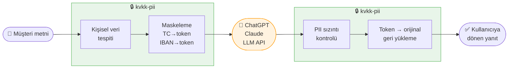

# kvkk-pii

[](https://pypi.org/project/kvkk-pii/)
[](https://pypi.org/project/kvkk-pii/)
[](LICENSE)

**Türkçe metinlerde kişisel veri tespiti, maskeleme ve KVKK uyum kontrolü — tek kütüphane.**

---

Şirketinizde yapay zekâ kullanılıyor. Destek ekibi müşteri mesajlarını ChatGPT'ye yapıştırıyor. Geliştiriciler API'ye tam metni gönderiyor. Muhasebe e-postaları özetletiliyor.

Bu metinlerin içinde ne var?

**TC kimlik numarası. IBAN. Telefon numarası. Hasta bilgisi. Kişi adları.**

Bunların tamamı — yani PII (Personally Identifiable Information / kişisel tanımlanabilir bilgi) — o anda OpenAI, Google veya başka bir şirketin sunucusuna gidiyor. Çoğu zaman kimse farkında bile değil.

Bu bir KVKK ihlali. Ve son kullanıcı değil, veriyi işleyen şirket sorumlu.

---

### İki yönlü koruma — veri hiç dışarı çıkmaz

`kvkk-pii` yapay zekâ entegrasyonlarında **iki yönlü çalışır:**



Yapay zekâ modeli hiçbir zaman gerçek kişisel veriyi görmez.

```python
from kvkk_pii import PiiDetector

detector = PiiDetector(layers=["regex", "ner"])

sonuc = detector.two_way(
    prompt="Ahmet Yılmaz (TC: 10000000146) iade talebini ilet.",
    call_fn=lambda maskeli: openai_cagri(maskeli),
)

print(sonuc.output)         # AI yanıtı — orijinal isim ve TC geri yüklendi
print(sonuc.report.safe)    # True → hiçbir veri sızmadı
```

---

### PII sızıntısı (PII leakage) nedir?

Yapay zekâ modeline maskelenmiş veri gönderdiniz — ama model yanıtında yine de gerçek kişisel veriyi kullandı. Ya da prompt içindeki kişisel veriyi hiç fark etmeden geçirdiniz ve model bunu üçüncü bir içeriğe dahil etti. Buna **PII sızıntısı** denir.

`kvkk-pii` AI yanıtını otomatik tarar: maskelenen veriler geri döndü mü, yeni kişisel veri ortaya çıktı mı, risk var mı?

```python
print(sonuc.report.leaked)    # sızan veri listesi
print(sonuc.report.new_pii)   # AI'ın kendi ürettiği kişisel veri
print(sonuc.report.risk_score) # 0.0 güvenli — 1.0 kritik
```

---

### KVKK uyum (compliance) raporu

Sadece maskeleme değil — işlenen verinin **hangi KVKK maddesini ilgilendirdiğini**, risk seviyesini ve yasal öneriyi de raporlar.

```python
rapor = detector.compliance_report(metin)
print(rapor.summary())
# KVKK Uyum Raporu — genel risk: KRİTİK
# KVKK Madde 6 (Özel Nitelikli Veri) tespit edildi!
#   [KRİTİK] SAGLIK_VERISI — Açık rıza zorunlu.
```

---

`pip install kvkk-pii`

---

## Ne yapar?

- **TC Kimlik, IBAN, VKN, telefon, plaka, e-posta** → regex + checksum doğrulama
- **Kişi adı, kurum, konum** → Türkçe NER modeli (XLM-RoBERTa)
- **Sağlık verisi, dini inanç, siyasi görüş** → KVKK Madde 6 (GLiNER, sıfır atışlı)
- **Yapay zekâ proxy** → maskele → AI → sızıntı tespiti → geri yükle
- **KVKK uyum raporu** → hangi madde ihlal edildi, risk seviyesi nedir
- **Tamamen yerel** → hiçbir veri dışarı çıkmaz, model cihazda çalışır

---

## Kurulum

```bash
pip install kvkk-pii          # sadece regex (bağımlılık yok)
pip install kvkk-pii[ner]     # + Türkçe NER (~450 MB)
pip install kvkk-pii[full]    # + KVKK Madde 6 GLiNER (~180 MB)
```

---

## Gerçek Senaryolar

### Senaryo 1 — Destek ekibi müşteri mesajını AI ile yanıtlıyor

Müşteri: *"TC'im 10000000146, siparişim nerede?"*

Bu mesaj olduğu gibi ChatGPT'ye giderse TC numarası OpenAI sunucularına ulaşır.

```python
detector = PiiDetector(layers=["regex", "ner"])

mesaj = "TC'im 10000000146, siparişim nerede?"
session = detector.create_session(mesaj)
maskeli = session.mask()
# → "TC'im [TC_KIMLIK_a3f], siparişim nerede?"

ai_yaniti = openai_cagri(maskeli)
# AI yanıtlar: "[TC_KIMLIK_a3f] numaralı siparişiniz kargoda."

temiz_yanit = session.restore(ai_yaniti)
# → "10000000146 numaralı siparişiniz kargoda."
```

TC numarası hiç OpenAI'a gitmedi.

---

### Senaryo 2 — Finansal e-posta özetleme

Muhasebe ekibi IBAN ve tutar içeren e-postaları AI ile özetlettiriyor.

```python
eposta = """
Sayın Fatma Kaya,
TR33 0006 1005 1978 6457 8413 26 no'lu hesabınıza
42.500 TL ödeme yapılacaktır. İmzalı teyit bekliyoruz.
"""

sonuc = detector.two_way(
    prompt=eposta,
    call_fn=lambda m: ai_ozet(m),
    on_leak="raise",  # sızıntı varsa hata fırlat
)

print(sonuc.output)
# → Fatma Kaya'nın hesabına 42.500 TL ödeme yapılacak...
#   (IBAN ve isim AI'ya gitmedi, özette geri yüklendi)
```

---

### Senaryo 3 — Sağlık verisi tespiti (KVKK Madde 6)

Hasta notlarında özel nitelikli veri otomatik işaretlenir.

```python
detector = PiiDetector(layers=["regex", "ner", "gliner"])

not_ = "Hasta tip 2 diyabet tanısı almış, Sünni mezhebine mensup."
rapor = detector.compliance_report(not_)

print(rapor.summary())
# KVKK Uyum Raporu — genel risk: KRİTİK
# KVKK Madde 6 (Özel Nitelikli Veri) tespit edildi!
#   [KRİTİK] SAGLIK_VERISI — Açık rıza zorunlu.
#   [KRİTİK] DINI_INANC   — Kural olarak işlenemez.

print(rapor.has_madde6)  # True
```

---

### Senaryo 4 — Log anonimleştirme

Uygulama loglarında kişisel veri varsa KVKK ihlali doğar.

```python
import logging
from kvkk_pii import PiiDetector

detector = PiiDetector()

class KvkkLogFilter(logging.Filter):
    def filter(self, record):
        record.msg = detector.anonymize(str(record.msg))
        return True

logging.getLogger().addFilter(KvkkLogFilter())

# Artık loglar otomatik temizlenir:
logging.info("Kullanıcı 0532 123 45 67 ile giriş yaptı")
# → "Kullanıcı [TELEFON_TR] ile giriş yaptı"
```

---

### Senaryo 5 — FastAPI servisi

```python
from fastapi import FastAPI
from kvkk_pii import AsyncPiiDetector

app = FastAPI()
detector = AsyncPiiDetector(layers=["regex", "ner"])

@app.post("/tarama")
async def tarama(metin: str):
    sonuc = await detector.analyze(metin)
    return {
        "pii_var": bool(sonuc.entities),
        "tipler": [e.entity_type for e in sonuc.entities],
        "anonim": sonuc.anonymize(),
    }

@app.post("/anonim")
async def anonim(metin: str):
    return {"sonuc": await detector.anonymize(metin)}
```

---

## Tespit Edilen Veri Türleri

### Katman 1 — Regex + Checksum (bağımlılık yok)

| Tür | Açıklama | Doğrulama |
|-----|----------|-----------|
| `TC_KIMLIK` | TC kimlik numarası (11 hane) | Checksum |
| `VKN` | Vergi kimlik numarası (10 hane) | Checksum |
| `IBAN_TR` | IBAN (tüm ülke kodları) | Mod97 |
| `KREDI_KARTI` | Kredi kartı numarası | Luhn |
| `TELEFON_TR` | Türk telefon numaraları | — |
| `EMAIL` | E-posta adresi | — |
| `IP_ADRESI` | IPv4 adresi | — |
| `PLAKA_TR` | Türk plaka numarası | — |
| `PASAPORT_TR` | Türk pasaport numarası | — |
| `SGK_NO` | SGK işyeri numarası | — |
| `ADRES` | Sokak adresi | — |
| `TARIH` | Tarih | — |
| `KISI_ADI` | Ünvan bazlı kişi adı | — |

### Katman 2 — NER (`pip install kvkk-pii[ner]`)

Model: `akdeniz27/xlm-roberta-base-turkish-ner` — %94.92 F1

| Tür | Açıklama |
|-----|----------|
| `KISI_ADI` | Kişi adı |
| `KONUM` | Şehir, ilçe, ülke |
| `KURUM` | Şirket, kurum adı |

### Katman 3 — KVKK Madde 6 (`pip install kvkk-pii[full]`)

Model: `urchade/gliner_multi-v2.1` — sıfır atışlı, 100+ dil

| Tür | Açıklama |
|-----|----------|
| `SAGLIK_VERISI` | Sağlık ve tıbbi veri |
| `DINI_INANC` | Din, mezhep bilgisi |
| `SIYASI_GORUS` | Siyasi görüş |
| `SENDIKA_UYELIGII` | Sendika üyeliği |
| `BIYOMETRIK_VERI` | Biyometrik / genetik veri |

---

## Diğer Özellikler

### Hazır preset'ler

```python
from kvkk_pii import presets

detector = presets.turkish()       # KVKK — tam Türkçe destek
detector = presets.german()        # DSGVO
detector = presets.french()        # RGPD
detector = presets.multilingual()  # TR + DE + FR
```

### Komut satırı

```bash
kvkk-pii scan "Ali Veli TC: 10000000146"
kvkk-pii scan --layer ner belge.txt
kvkk-pii scan --format json "metin"
kvkk-pii anonymize "Ali Veli TC: 10000000146"
cat log.txt | kvkk-pii anonymize
```

### Özel recognizer

```python
from kvkk_pii import BaseRecognizer, PiiEntity

class SicilNoRecognizer(BaseRecognizer):
    entity_type = "SICIL_NO"

    def find(self, text: str) -> list[PiiEntity]:
        import re
        return [
            self._entity(m.group(), m.start(), m.end(), score=1.0)
            for m in re.finditer(r"\bSCL-\d{6}\b", text)
        ]
```

---

## Gereksinimler

- Python 3.10+
- Temel kurulum: sıfır bağımlılık
- NER/GLiNER: `transformers`, `torch`, `huggingface-hub`, `gliner`

---

## Lisans

MIT
